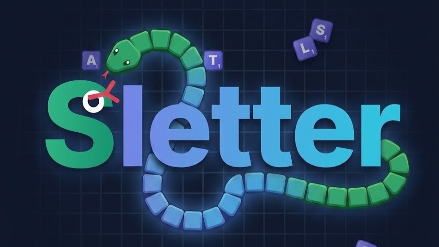

*Ler noutros idiomas: [Español](README.md), [English](README-en.md), [Français](README-fr.md), [Galego](README-gl.md), [Català](README-ca.md)*



# Sletter 🐍🔤

Sletter é un xogo educativo de navegador que combina as mecánicas do clásico **Snake** coa formación de palabras.

O obxectivo é mover a serpe, comer fichas con letras e formar palabras válidas de tres letras ou máis, evitando chocar cos bordos ou co teu propio corpo.


## Características Principais 🚀

- **Xogo Híbrido:** Mecánica clásica de movemento estilo Snake con validación de dicionario en tempo real.
- **Multilingüe:** Soporte completo para xogar en cinco idiomas con dicionarios de alta capacidade validados localmente:
  - 🇪🇸 **Español:** 636.598 palabras.
  - 🇺🇸 **Inglés:** 274.937 palabras.
  - 🇫🇷 **Francés:** 336.524 palabras.
  - 💙🟡 **Galego:** 687.447 palabras.
  - 💛🟥 **Catalán:** 891.424 palabras.
- **Soporte Offline (PWA Ready):** Os dicionarios descárganse a primeira vez e almacénanse no navegador usando **IndexedDB**, permitindo xogar sen conexión a internet posteriormente.
- **Motor de Audio Retro:** Efectos de son de 8 bits sintetizados dinámicamente mediante a **Web Audio API** (sen depender de ficheiros `.mp3` ou `.wav` externos).
- **Ranking Global:** Sistema de récords locais (`localStorage`) que garda as túas mellores puntuacións co teu alias e a bandeira do idioma xogado.
- **Personalización Visual:** Soporte responsivo e temas Claro/Escuro dinámicos.

## Arquitectura e Tecnoloxías 🏗️

O proxecto está construído baixo unha arquitectura modular (Frontend ES6) sen usar frameworks pesados:

- **HTML5 Canvas:** Para o renderizado de alto rendemento do taboleiro e a serpe.
- **Vanilla JavaScript (Módulos ES6):** Lóxica desacoplada mediante un patrón `Pub/Sub` (EventBus) e división estricta de responsabilidades (`game.js`, `audio.js`, `storage.js`, `ui.js`, `dictionary.js`).
- **CSS3 e Tailwind CSS:** Uso de clases utilitarias a través de CDN para unha interface moderna, limpa e altamente responsiva.
- **IndexedDB & LocalStorage:** Persistencia de datos asíncrona para dicionarios (xigantes) e datos rápidos síncronos para puntuacións/axustes.
- **Web Audio API:** Síntese procedural do son.

## Instalación e Desenvolvemento 🛠️

Ao estar estruturado con **Módulos ES6 (`import`/`export`)**, abrir o ficheiro `index.html` directamente no navegador xerará un erro de `CORS`. Requírese un servidor local para probalo:

1. Clona o repositorio:
   ```bash
   git clone https://github.com/s-letter/s-letter.github.io.git
   ```
2. Inicia un servidor web local na carpeta raíz. Podes usar a extensión **Live Server** de VSCode, ou mediante liña de comandos:
   - **Python 3:** `python -m http.server 8000`
   - **Node.js (npx):** `npx serve`
3. Abre `http://localhost:8000` no teu navegador web.

## Agradecementos e Dicionarios 📚

Os extensos dicionarios integrados en **Sletter** foron posibles grazas a proxectos lingüísticos e repositorios de código aberto. Recoñecemos e agradecemos ás comunidades que manteñen estas bases de datos léxicas:

- **Español (636k palabras):** [github.com/words/an-array-of-spanish-words](https://github.com/words/an-array-of-spanish-words)
- **Inglés (274k palabras):** [github.com/words/an-array-of-english-words](https://github.com/words/an-array-of-english-words)
- **Francés (336k palabras):** [github.com/words/an-array-of-french-words](https://github.com/words/an-array-of-french-words)
- **Galego (687k palabras):** [github.com/s-letter/an-array-of-galician-words](https://github.com/s-letter/an-array-of-galician-words)
- **Catalán (891k palabras):** [github.com/s-letter/an-array-of-catalan-words](https://github.com/s-letter/an-array-of-catalan-words)

## Autor 👨‍💻

**Pablo G. Guízar**

- [LinkedIn](https://www.linkedin.com/in/pablogguizar/)
- [GitHub](https://github.com/PabloGGuizar)

## Licenza 📄

Este proxecto está baixo licenza [MIT](LICENSE).
